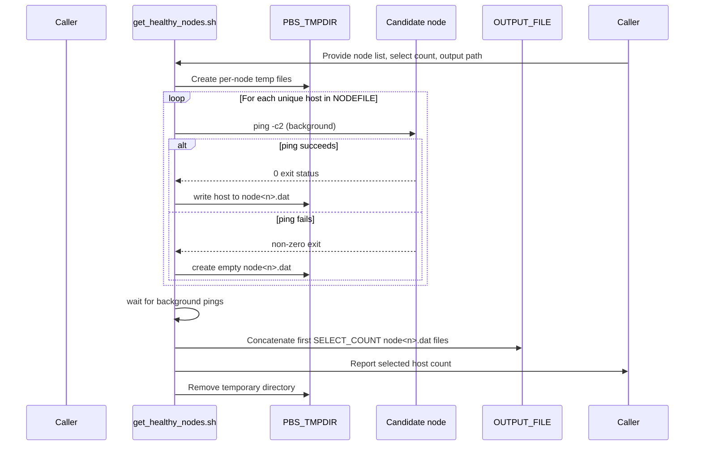
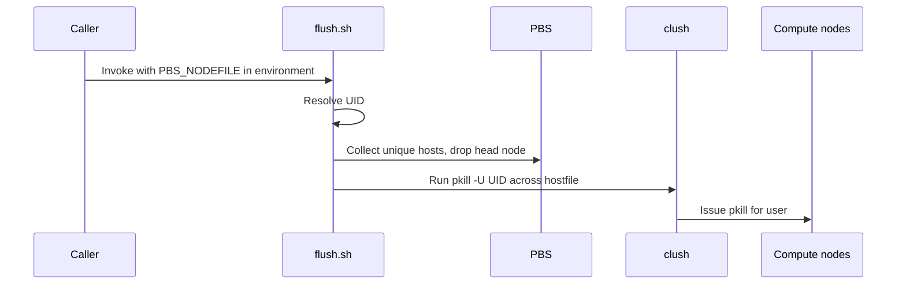
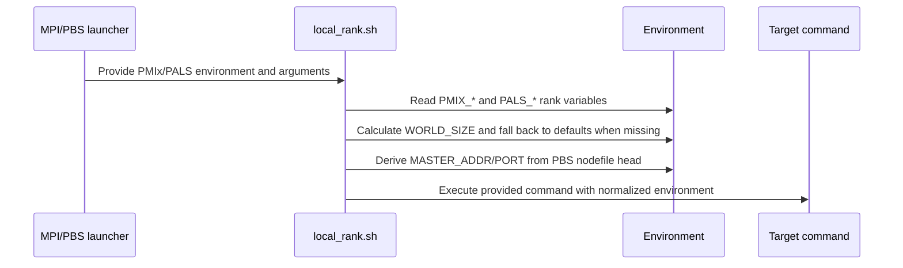
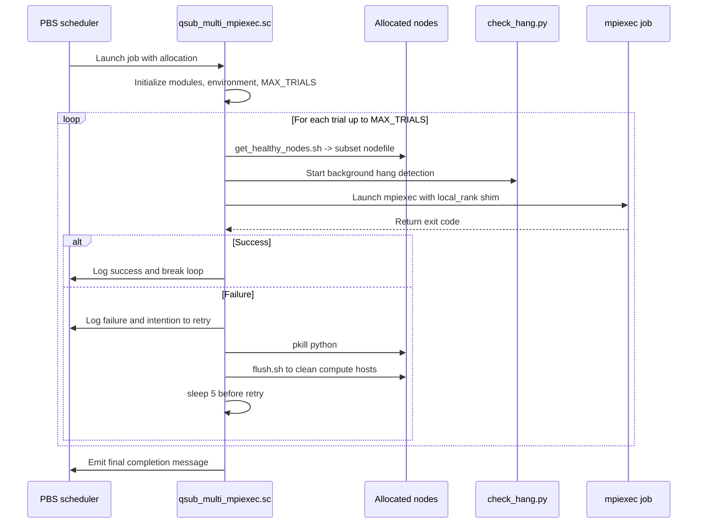
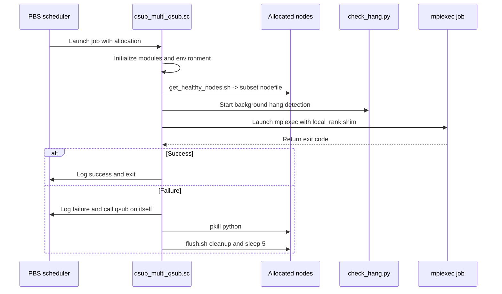

# Logic and Orchestration of Shell Scripts

This document summarizes the orchestration logic used by the shell utilities that ship with the
checkpoint/restart examples.  Each section provides a narrative description and a Mermaid sequence
diagram so that the interactions between commands, files, and cluster services can be understood at a
glance.

## `get_healthy_nodes.sh`

`get_healthy_nodes.sh NODEFILE SELECT_COUNT OUTPUT_FILE` inspects the allocation that PBS provides and
builds a node file containing only the first `SELECT_COUNT` responsive hosts.  The script launches
parallel `ping` checks, records healthy nodes, and concatenates the requested number of results.

### Flow of control

## `flush.sh`

`flush.sh` cleans residual user processes across the nodes of a job.  The first node in
`$PBS_NODEFILE` is considered the head node and is skipped; all other unique nodes receive a `pkill`
call that targets the current user ID.

### Flow of control

## `local_rank.sh`

`local_rank.sh` normalizes environment variables required by distributed PyTorch or MPI launchers. It
prioritizes PALS/PMIx variables when available, computes a global `WORLD_SIZE`, selects a master
address, and finally delegates to the command that was supplied on the script's command line.

### Flow of control

## `qsub_multi_mpiexec.sc`

`qsub_multi_mpiexec.sc` is a PBS submission script that reruns a failing MPI workload inside the same
allocation until it succeeds or the trial limit is reached.

### Flow of control

## `qsub_multi_qsub.sc`

`qsub_multi_qsub.sc` is an alternative PBS submission script that resubmits itself upon failure. It
performs one trial per submission and uses the same helper utilities for health checks and cleanup.

### Flow of control

